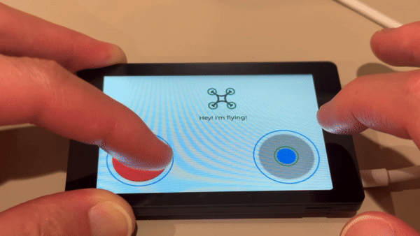

# LVGL Joystick Library

This library provides an easy way to create virtual joysticks for use in an LVGL environment. It supports both ESP-IDF and Arduino platforms and allows you to handle joystick input with customizable styles and callbacks.

[](https://youtu.be/QYOfr-VTves)

## Features

- Create virtual joysticks with customizable sizes and styles.
- Handle joystick movement with user-defined callbacks.
- Allows creation of multiple virtual joysticks, identifiable via ID.
- Supports both ESP-IDF and Arduino environments.

## Installation

### Arduino

**Install the Joystick Library**:
   - Download or clone this repository.
   - Copy the `LVGL_Joystick` folder to your Arduino `libraries` directory.

### ESP-IDF

**Add Joystick Library as a component**:
   - Clone the LVGL Joystick repository into your `components/` directory:

```bash
mkdir -p components
cd components
git clone https://github.com/0015/LVGL_Joystick
```

## Usage
```cpp   
    #include <lvgl.h>
    #include <joystick.h>

    void joystick_position_callback(uint8_t joystick_id, int16_t x, int16_t y) {
        Serial.printf("Joystick ID: %d, Position - X: %d, Y: %d\n", joystick_id, x, y);
    }

    void ui_init() {
        lv_obj_t *screen = lv_scr_act();
        create_joystick(screen, 1, LV_ALIGN_CENTER, 0, 0, 100, 25, NULL, NULL, joystick_position_callback);
    }

```
**You can check more details in the example project.**


## API Reference
```cpp   
void create_joystick(
    lv_obj_t *parent,
    uint8_t joystick_id,
    lv_align_t base_align,
    int base_x,
    int base_y,
    int base_radius,
    int stick_radius,
    lv_style_t *base_style,
    lv_style_t *stick_style,
    joystick_position_cb_t position_callback)
```
* Creates a joystick on the specified parent object.
    * lv_obj_t *parent: The parent LVGL object where the joystick will be created.
    * uint8_t joystick_id: A unique ID for the joystick.
    * lv_align_t base_align: Alignment for the base object of the joystick.
    * int base_x, int base_y: X and Y offsets for the base object's position.
    * int base_radius: The radius of the base (background) circle.
    * int stick_radius: The radius of the joystick (control) circle.
    * lv_style_t *base_style: Pointer to a custom style for the base object (can be NULL to use the default style).
    * lv_style_t *stick_style: Pointer to a custom style for the joystick object (can be NULL to use the default style).
    *  joystick_position_cb_t position_callback: Callback function for joystick position updates.


## Limitations

Since LVGL (the current version 9.2.0) does not support multi-touch, you cannot fire two touch events at the same time. More than two joysticks will be available as soon as LVGL is updated.